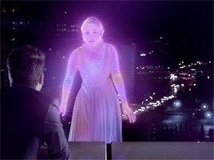
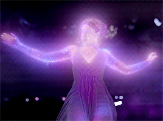
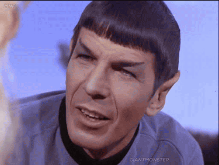
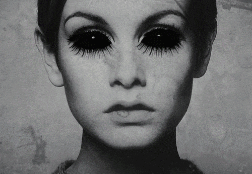
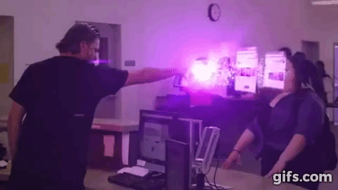

# Codename : Metamorphosis
### Subject 
---
- Artificial Intelligence 
- Deep Learning 
- Speech Recognition.
- Game Theory
- Image Processing
- Computer Vision

## simulation
---

---
## Virtual Reality - Character

- Subject VR 1

- Subject VR 2

---
## Subject Analysis [Character Sketch] - Predective Analysis

- Subject Elizabeth - Machine Learning data set

- Subject Pompi - Machine Learning data set

- Subject Spock - Machine Learning data set

---

## Image Processing

- Execution Output

- Simulation Imagination

